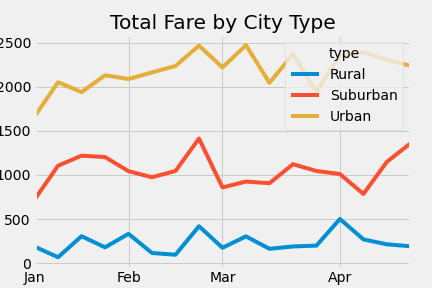

# PyBer_Analysis

## Overview

The purpose of this analysis is to compare ride sharing data between city types. More specifically, the data is used to calculate the total rides, drivers, and fares between urban, suburban, and rural city types. Once these numbers are found, we can calculate averages and create a summary DataFrame and multiple-line chart comparing each city type. 

## Results

The data shows that the average fare per ride and per driver increases in ascending order from urban cities to suburban cities to rural cities. As you can see in the summary dataframe, the data suggests that this could be due to the lack of total drivers compared to total rides. For instance, the supply of drivers in rural cities is lower than the demand for rides. Therefore, fares in rural cities are driven up. In contrast, the supply of drivers in urban cities is much higher than the demand for rides. This causes fares to stay low. In suburban cities, there is a more even ratio of rides to drivers, however the average fare is still higher than urban cities and lower than rural cities.

## Summary

To address these disparities between total rides and total drivers in these different city types I suggest the following:
- Incentivize more people to drive in rural areas with bonuses for joining.
- Adertise to a wider target audience in urban cities.
- Create a loyalty rewards program in all city types in order to retain business.
